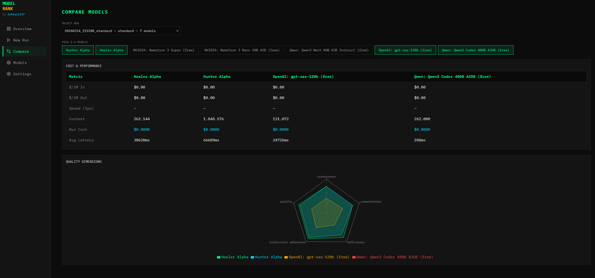
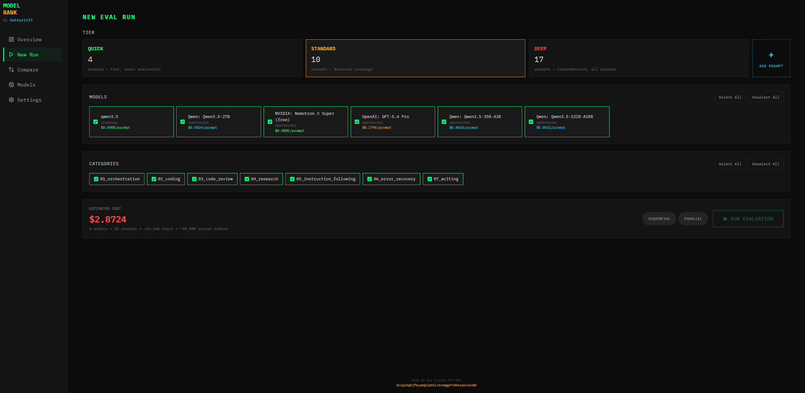
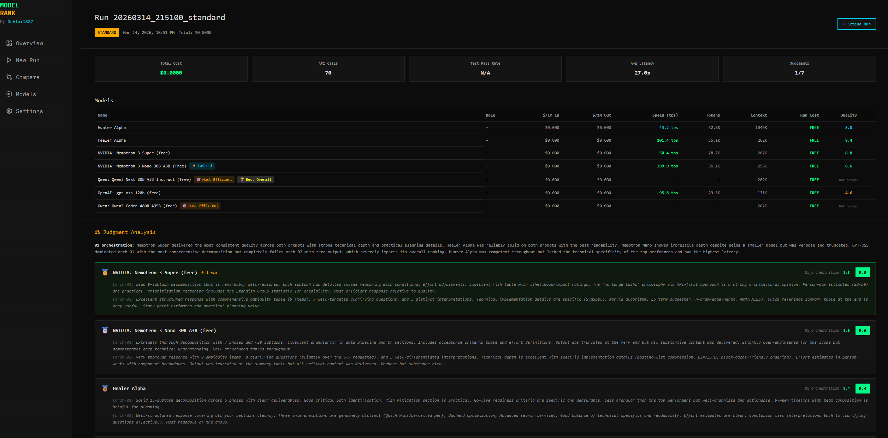

# ModelRank

**Self-hosted LLM evaluation dashboard** — test multiple AI models against identical prompts and compare their performance side by side.

ModelRank runs locally via Docker and provides a sleek terminal-themed UI to create evaluation runs, inspect results, and rank models by quality, speed, and cost.

---
### ☕ Support this project
**BTC:** `bc1q24qhjfhyudqkldn5lc9vemgpfv9hesanvcw70d`

---







## Key Features

- **Multi-model evaluation** — Run the same prompts against multiple LLMs and compare responses, scores, latency, and token usage in one view
- **Built-in prompt battery** — Ships with 17 curated prompts across 7 categories (Orchestration, Coding, Code Review, Research, Instruction Following, Error Recovery, Writing)
- **Three test tiers** — Quick (4 prompts), Standard (10 prompts), and Deep (17 prompts) for different evaluation depths
- **Custom prompts** — Generate your own prompts with AI assistance or write them manually, then add them to a dedicated Manual tier
- **Sequential & parallel execution** — Choose sequential mode for deterministic ordering or parallel mode with concurrency control for faster runs
- **Model medals** — Automatic badges for Fastest, Cheapest, Most Efficient, and Best Overall model in each run
- **Run comparison** — Compare any two evaluation runs side by side to track how models improve over time
- **AI judge scoring** — Each response is scored 1-10 by an LLM judge with detailed trait-by-trait evaluation
- **Multi-provider support** — Works with OpenRouter, Ollama, LM Studio, and any OpenAI-compatible API
- **Public mode** — Optional mode where API keys are stored in the browser (ideal for shared/demo instances)
- **Dark terminal theme** — Clean hacker-aesthetic UI with green/amber/cyan accents on a dark background
- **Zero external dependencies** — Everything runs inside a single Docker container with JSON file storage

---

## Quick Start

### Prerequisites

- [Docker](https://docs.docker.com/get-docker/) and Docker Compose installed
- An API key from at least one LLM provider (e.g., [OpenRouter](https://openrouter.ai/))

### 1. Clone the repository

```bash
git clone https://github.com/Dohtar1337/ModelRank.git
cd ModelRank
```

### 2. Start the container

```bash
docker compose up -d
```

This builds and starts ModelRank on **port 3008** by default.

### 3. Open the dashboard

Navigate to [http://localhost:3008](http://localhost:3008) in your browser. The first-time setup wizard will guide you through:

1. Choosing a provider (OpenRouter, Ollama, LM Studio, or Custom)
2. Entering your API key (if required)
3. Selecting which models to evaluate

Once setup is complete, you're ready to create your first evaluation run.

---

## Configuration

### Environment Variables

Set these in a `.env` file next to `docker-compose.yml`, or pass them directly:

| Variable | Default | Description |
|---|---|---|
| `PORT` | `3008` | Port the dashboard runs on |
| `OPENROUTER_API_KEY` | — | OpenRouter API key (can also be set in the UI) |
| `OPENAI_API_KEY` | — | OpenAI-compatible API key |
| `ANTHROPIC_API_KEY` | — | Anthropic API key |
| `PUBLIC_MODE` | `false` | When `true`, API keys are stored in the browser instead of on the server |

### Changing the port

```bash
PORT=8080 docker compose up -d
```

### Public Mode

Set `PUBLIC_MODE=true` to run ModelRank as a shared instance. In this mode:

- API keys are stored in each user's browser (localStorage), not on the server
- Only OpenRouter is available as a provider
- Users supply their own API key through the setup wizard
- No keys are persisted on the server

```bash
PUBLIC_MODE=true docker compose up -d
```

---

## Usage

### Creating an Evaluation Run

1. Go to **New Run** from the sidebar
2. Select the models you want to evaluate
3. Choose a test tier (Quick / Standard / Deep) or select specific categories
4. Pick an execution mode — **Sequential** (one at a time) or **Parallel** (concurrent with rate-limit handling)
5. Click **Run Evaluation** and watch results stream in

### Understanding Results

Each run produces a detailed breakdown:

- **Overall scores** — Average judge score (1-10) per model
- **Category scores** — How each model performed in Coding, Orchestration, Writing, etc.
- **Latency & TPS** — Response time and tokens-per-second for each prompt
- **Cost** — Token usage and estimated cost per model
- **Medals** — Automatic badges: Fastest (lowest latency), Cheapest (lowest cost), Most Efficient (best TPS), Best Overall (highest score)

### Comparing Runs

Go to **Compare** to put any two runs side by side. Useful for tracking model performance across different configurations or over time.

### Custom Prompts

On the **New Run** page, use the **Generate Prompts** section to:

- Have an AI generate evaluation prompts for any category
- Write prompts manually
- Add them to the Manual tier for use in future runs

### Settings

The **Settings** page lets you:

- Manage API keys for different providers
- Add, edit, or remove LLM providers and their models
- Configure base URLs for local/custom providers

---

## Architecture

ModelRank is a single-container application:

```
ModelRank/
├── docker-compose.yml        # Container orchestration
├── dashboard/
│   ├── Dockerfile            # Multi-stage build (node:20-alpine)
│   ├── server/
│   │   ├── index.js          # Express.js API server
│   │   └── eval-runner.js    # Parallel evaluation engine
│   └── src/
│       ├── App.jsx           # React app with routing
│       └── pages/            # Dashboard pages (Overview, NewRun, RunDetail, etc.)
└── data/
    ├── config/
    │   ├── providers.json    # Provider configurations
    │   ├── models.json       # Model definitions
    │   └── battery.json      # Prompt battery with tiers
    ├── results/              # Evaluation run results (JSON)
    ├── scripts/
    │   └── run-eval.sh       # Bash eval runner (sequential mode)
    └── tests/                # Test scripts for prompt validation
```

**Tech stack:** React 18 + Vite + Tailwind CSS frontend, Express.js backend, JSON file storage. All data persists in the `./data` volume mount.

---

## Supported Providers

| Provider | API Key Required | Model Browsing | Notes |
|---|---|---|---|
| **OpenRouter** | Yes | Yes (auto-fetches model list) | Recommended — access to 200+ models |
| **Ollama** | No | Yes (auto-detects local models) | Local inference, no cost |
| **LM Studio** | No | Yes | Local inference via OpenAI-compatible API |
| **llama.cpp** | No | No (manual entry) | Run GGUF models locally via llama-server |
| **Custom** | Varies | No (manual entry) | Any OpenAI-compatible endpoint |

Additional providers can be added after setup through the Settings page.

---

## Data Persistence

All data is stored in the `./data` directory which is mounted as a Docker volume. This means:

- Evaluation results survive container rebuilds
- Config changes persist across restarts
- You can back up everything by copying the `data/` folder

To reset to a clean state, stop the container and delete the contents of `data/config/` and `data/results/`.

---

## Troubleshooting

### Container won't start

```bash
docker compose logs modelrank
```

### Rebuild after code changes

```bash
docker compose build --no-cache && docker compose up -d
```

### Eval runs fail with "No prompts match the filters"

This usually means the prompt battery is misconfigured. Check `data/config/battery.json` — the `tiers` arrays should contain prompt ID strings (e.g., `"code-01"`), not full objects.

### Rate limiting (HTTP 429)

ModelRank automatically retries rate-limited requests with exponential backoff (5s, 15s, 30s). If you're hitting limits frequently, use Sequential mode or reduce the number of models per run.

---

## License

MIT — see [LICENSE](LICENSE) for details.

---

Built by [Dohtar1337](https://github.com/Dohtar1337)
